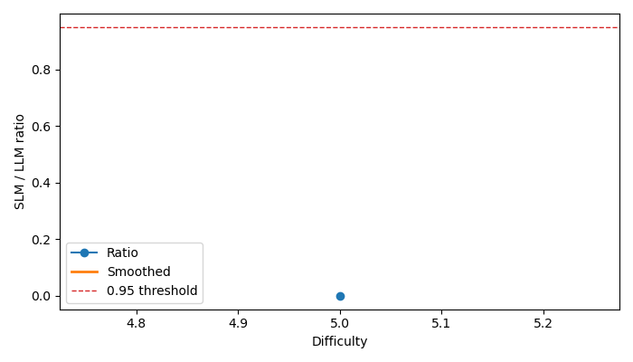

# Part B - SDDF Analysis

- Benchmark: `information_extraction`
- Run path: `Information Extraction\outputs_hf_llama1b_gemini_pair`
- Interpretation note: sections marked `partial` are inference-augmented summaries derived from historical benchmark artifacts rather than fresh matched reruns.

## SDDF: Dominant Difficulty Dimension

- Status: `available`
- Reason: Computed from SDDF archive.

### Summary

- `|Gamma|`: 8 examples

## Difficulty Annotation + Binning

- Status: `available`
- Reason: Computed from SDDF archive.

### Bin Counts

- Bin `nan` / `LLM`: 4 rows
- Bin `nan` / `SLM`: 4 rows

## Matched SLM vs LLM Analysis

- Status: `available`
- Reason: Computed from SDDF archive.

### Pairs

- `Llama-3.2-1B-Instruct` vs `gemini-2.5-flash-lite` on `clean`: 4 matched examples

## Capability Curve + Tipping Point

- Status: `available`
- Reason: Computed from SDDF archive.

### Llama-3.2-1B-Instruct vs gemini-2.5-flash-lite

- Tipping point: `None`
- Tipping sensitivity: `{'0.90': None, '0.93': None, '0.95': None, '0.97': None}`
- Plot file: `Information Extraction\outputs_hf_llama1b_gemini_pair\sddf\reports\clean_llama_3_2_1b_instruct_vs_gemini_2_5_flash_lite.png`

## Uncertainty Analysis

- Status: `available`
- Reason: Computed from SDDF archive.

### Llama-3.2-1B-Instruct vs gemini-2.5-flash-lite

- Tipping median: `None`
- 95% CI: `None` to `None`
- Threshold sweep: `{'0.90': None, '0.93': None, '0.95': None, '0.97': None}`

## Failure Taxonomy

- Status: `available`
- Reason: Computed from SDDF archive.

- Heuristic structural failures: 0
- Heuristic fixable failures: 8
- Invalid outputs: 1
- Validity note: partial or invalid runs should be excluded from strict cross-model comparison.
- Note: this taxonomy is heuristic and should be reviewed against task-specific failure labels.

## Quality Gate

- Status: `available`
- Reason: Computed from SDDF archive.

### Llama-3.2-1B-Instruct vs gemini-2.5-flash-lite

## Size-First Decision Matrix

- Status: `available`
- Reason: Computed from SDDF archive.

### Llama-3.2-1B-Instruct vs gemini-2.5-flash-lite

- Bin `0` at difficulty `5.000` contributes to the tau-based threshold evidence.

## Two-Stage Routing Policy

- Status: `available`
- Reason: Computed from SDDF archive.

### Llama-3.2-1B-Instruct vs gemini-2.5-flash-lite

- No routing threshold learned.

