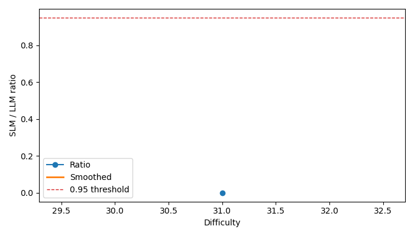

# Part A - Benchmark Setup

- Benchmark: `retrieval_grounded`
- Run path: `Retrieval_grounded\outputs_hf_llama1b_smoke`

## Task Definition

```json
{
  "task": "retrieval_grounded",
  "dataset": "squad"
}
```

## Dataset and Sampling

```json
{
  "num_questions": 6,
  "dataset_split": "validation"
}
```

## Experimental Setup

```json
{
  "config": {
    "dataset_name": "squad",
    "dataset_split": "validation",
    "num_questions": 6,
    "max_context_tokens": 80,
    "max_answer_tokens": 16,
    "models": [
      "hf_api:meta-llama/Llama-3.2-1B-Instruct"
    ],
    "temperature": 0.0,
    "top_p": 1.0,
    "max_new_tokens": 24,
    "do_sample": false,
    "device": "cpu",
    "output_dir": "Retrieval_grounded/outputs_hf_llama1b_smoke",
    "save_per_model": true
  },
  "environment": {
    "platform": "Windows-11-10.0.26200-SP0",
    "python_version": "3.12.7",
    "torch_version": "2.10.0+cpu",
    "transformers_version": "5.2.0",
    "cuda_available": false,
    "cuda_device_count": 0
  }
}
```

## Metrics

```json
{
  "hf_api:meta-llama/Llama-3.2-1B-Instruct": {
    "model": "hf_api:meta-llama/Llama-3.2-1B-Instruct",
    "capability": {
      "exact_match": 0.0,
      "f1_score": 27.727272727272723,
      "context_utilization_rate": 0.0,
      "answer_length_accuracy": 66.66666666666667
    },
    "reliability": {
      "hallucination_rate": 100.0,
      "unsupported_answer_rate": 100.0,
      "partial_answer_rate": 66.66666666666667
    },
    "operational": {
      "latency_ms": 923.4836666631358,
      "latency_p50_ms": 918.0870000272989,
      "latency_p95_ms": 914.1464999993332,
      "tokens_per_sec": 14.979510556280792,
      "output_tokens_total": 83,
      "input_tokens_avg": 71.16666666666667,
      "memory_mb": 0.0,
      "wall_time_sec": 5.548556566238403,
      "questions": 6
    }
  },
  "gemini/gemini-3.1-flash-lite-preview": {
    "model": "gemini/gemini-3.1-flash-lite-preview",
    "capability": {
      "exact_match": 50.0,
      "f1_score": 50.0,
      "context_utilization_rate": 50.0,
      "answer_length_accuracy": 83.33333333333333
    },
    "reliability": {
      "hallucination_rate": 50.0,
      "unsupported_answer_rate": 50.0,
      "partial_answer_rate": 0.0
    },
    "operational": {
      "latency_ms": 4564.556933318575,
      "latency_p50_ms": 1115.8705999841914,
      "latency_p95_ms": 22451.590100012254,
      "tokens_per_sec": 2.4098724499866533,
      "output_tokens_total": 66,
      "input_tokens_avg": 94.83333333333333,
      "memory_mb": 0.0,
      "questions": 6
    }
  }
}
```

## Raw Benchmark Results

```json
{
  "prediction_files": [
    "C:\\Users\\riddh\\OneDrive\\Desktop\\SLM use cases\\Retrieval_grounded\\outputs_hf_llama1b_smoke\\predictions\\predictions_gemini_gemini-3.1-flash-lite-preview.json"
  ],
  "example_count_per_prediction_file": 6
}
```

# Part B - SDDF Analysis

- Benchmark: `retrieval_grounded`
- Run path: `Retrieval_grounded\outputs_hf_llama1b_smoke`
- Interpretation note: sections marked `partial` are inference-augmented summaries derived from historical benchmark artifacts rather than fresh matched reruns.

## SDDF: Dominant Difficulty Dimension

- Status: `available`
- Reason: Computed from SDDF archive.

### Summary

- `n_in`: 12 examples

## Difficulty Annotation + Binning

- Status: `available`
- Reason: Computed from SDDF archive.

### Bin Counts

- Bin `nan` / `LLM`: 6 rows
- Bin `nan` / `SLM`: 6 rows

## Matched SLM vs LLM Analysis

- Status: `available`
- Reason: Computed from SDDF archive.

### Pairs

- `hf_api:meta-llama/Llama-3.2-1B-Instruct` vs `gemini/gemini-3.1-flash-lite-preview` on `retrieval_grounded`: 6 matched examples

## Capability Curve + Tipping Point

- Status: `available`
- Reason: Computed from SDDF archive.

### hf_api:meta-llama/Llama-3.2-1B-Instruct vs gemini/gemini-3.1-flash-lite-preview

- Tipping point: `None`
- Tipping sensitivity: `{'0.90': None, '0.93': None, '0.95': None, '0.97': None}`
- Plot file: `Retrieval_grounded\outputs_hf_llama1b_smoke\sddf\reports\retrieval_grounded_hf_api_meta_llama_llama_3_2_1b_instruct_vs_gemini_gemini_3_1_flash_lite_preview.png`




## Uncertainty Analysis

- Status: `available`
- Reason: Computed from SDDF archive.

### hf_api:meta-llama/Llama-3.2-1B-Instruct vs gemini/gemini-3.1-flash-lite-preview

- Tipping median: `None`
- 95% CI: `None` to `None`
- Threshold sweep: `{'0.90': None, '0.93': None, '0.95': None, '0.97': None}`


## Failure Taxonomy

- Status: `available`
- Reason: Computed from SDDF archive.

- Heuristic structural failures: 0
- Heuristic fixable failures: 12
- Invalid outputs: 0
- Validity note: partial or invalid runs should be excluded from strict cross-model comparison.
- Note: this taxonomy is heuristic and should be reviewed against task-specific failure labels.

## Quality Gate

- Status: `available`
- Reason: Computed from SDDF archive.

### hf_api:meta-llama/Llama-3.2-1B-Instruct vs gemini/gemini-3.1-flash-lite-preview


## Size-First Decision Matrix

- Status: `available`
- Reason: Computed from SDDF archive.

### hf_api:meta-llama/Llama-3.2-1B-Instruct vs gemini/gemini-3.1-flash-lite-preview

- Bin `0` at difficulty `31.000` contributes to the tau-based threshold evidence.


## Two-Stage Routing Policy

- Status: `available`
- Reason: Computed from SDDF archive.

### hf_api:meta-llama/Llama-3.2-1B-Instruct vs gemini/gemini-3.1-flash-lite-preview

- No routing threshold learned.


