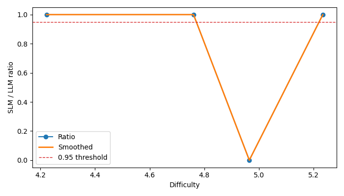
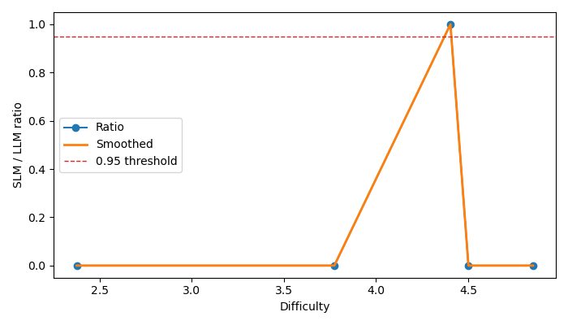
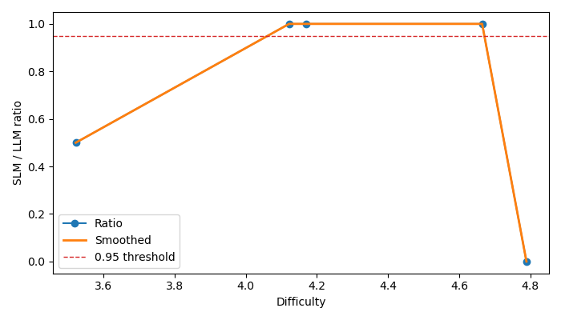

# Part A - Benchmark Setup

- Benchmark: `classification`
- Run path: `classification\runs_hf_gemini_fast15`

## Task Definition

```json
{
  "task": "classification",
  "datasets": [
    "SST-2",
    "Emotion",
    "AG News"
  ]
}
```

## Dataset and Sampling

```json
{
  "model": "hf_api:meta-llama/Llama-3.2-1B-Instruct",
  "workers": 1,
  "profile": "fast15",
  "input_file": null,
  "dataset_name": null,
  "test_mode": false,
  "seed": 42
}
```

## Experimental Setup

```json
{
  "model": "hf_api:meta-llama/Llama-3.2-1B-Instruct",
  "workers": 1
}
```

## Metrics

```json
{
  "capability": {
    "SST-2": {
      "accuracy": 0.6666666666666666,
      "macro_f1": 0.625,
      "weighted_f1": 0.625,
      "precision": 0.8,
      "recall": 0.6666666666666666,
      "validity_rate": 1.0
    },
    "Emotion": {
      "accuracy": 0.16666666666666666,
      "macro_f1": 0.05714285714285715,
      "weighted_f1": 0.06666666666666667,
      "precision": 0.03571428571428571,
      "recall": 0.14285714285714285,
      "validity_rate": 0.8333333333333334
    },
    "AG News": {
      "accuracy": 0.75,
      "macro_f1": 0.6666666666666666,
      "weighted_f1": 0.6666666666666666,
      "precision": 0.625,
      "recall": 0.75,
      "validity_rate": 1.0
    }
  },
  "operational": [
    {
      "dataset": "SST-2",
      "total_samples": 6,
      "total_time": 4.513972043991089,
      "throughput": 1.329206282521639,
      "latency_mean": 0.7505270640055338,
      "latency_p95": 1.026934027671814,
      "cpu_util_avg": 28.4,
      "mem_usage_delta_mb": 54.74609375,
      "parse_failure_rate": 0.0
    },
    {
      "dataset": "Emotion",
      "total_samples": 6,
      "total_time": 4.388450860977173,
      "throughput": 1.3672250618898316,
      "latency_mean": 0.7284363905588785,
      "latency_p95": 0.8024417161941528,
      "cpu_util_avg": 36.35,
      "mem_usage_delta_mb": 69.1640625,
      "parse_failure_rate": 0.16666666666666666
    },
    {
      "dataset": "AG News",
      "total_samples": 4,
      "total_time": 2.6536805629730225,
      "throughput": 1.5073404296704962,
      "latency_mean": 0.6623392105102539,
      "latency_p95": 0.706290888786316,
      "cpu_util_avg": 28.75,
      "mem_usage_delta_mb": -27.6640625,
      "parse_failure_rate": 0.0
    }
  ]
}
```

## Raw Benchmark Results

```json
{
  "raw_result_file_count": 2,
  "latest_row_count": 16,
  "columns": [
    "text",
    "true_label",
    "prediction",
    "latency",
    "is_valid",
    "dataset",
    "status"
  ]
}
```

# Part B - SDDF Analysis

- Benchmark: `classification`
- Run path: `classification\runs_hf_gemini_fast15`
- Interpretation note: sections marked `partial` are inference-augmented summaries derived from historical benchmark artifacts rather than fresh matched reruns.

## SDDF: Dominant Difficulty Dimension

- Status: `available`
- Reason: Computed from SDDF archive.

### Summary

- `H`: 32 examples

## Difficulty Annotation + Binning

- Status: `available`
- Reason: Computed from SDDF archive.

### Bin Counts

- Bin `0` / `LLM`: 5 rows
- Bin `0` / `SLM`: 5 rows
- Bin `1` / `LLM`: 3 rows
- Bin `1` / `SLM`: 3 rows
- Bin `2` / `LLM`: 3 rows
- Bin `2` / `SLM`: 3 rows
- Bin `3` / `LLM`: 2 rows
- Bin `3` / `SLM`: 2 rows
- Bin `4` / `LLM`: 3 rows
- Bin `4` / `SLM`: 3 rows

## Matched SLM vs LLM Analysis

- Status: `available`
- Reason: Computed from SDDF archive.

### Pairs

- `hf_api:meta-llama/Llama-3.2-1B-Instruct` vs `gemini-3.1-flash-lite-preview` on `AG News`: 4 matched examples
- `hf_api:meta-llama/Llama-3.2-1B-Instruct` vs `gemini-3.1-flash-lite-preview` on `Emotion`: 6 matched examples
- `hf_api:meta-llama/Llama-3.2-1B-Instruct` vs `gemini-3.1-flash-lite-preview` on `SST-2`: 6 matched examples

## Capability Curve + Tipping Point

- Status: `available`
- Reason: Computed from SDDF archive.

### hf_api:meta-llama/Llama-3.2-1B-Instruct vs gemini-3.1-flash-lite-preview

- Tipping point: `None`
- Tipping sensitivity: `{'0.90': None, '0.93': None, '0.95': None, '0.97': None}`
- Plot file: `classification\runs_hf_gemini_fast15\sddf\reports\ag_news_hf_api_meta_llama_llama_3_2_1b_instruct_vs_gemini_3_1_flash_lite_preview.png`



### hf_api:meta-llama/Llama-3.2-1B-Instruct vs gemini-3.1-flash-lite-preview

- Tipping point: `2.375`
- Tipping sensitivity: `{'0.90': 2.375, '0.93': 2.375, '0.95': 2.375, '0.97': 2.375}`
- Plot file: `classification\runs_hf_gemini_fast15\sddf\reports\emotion_hf_api_meta_llama_llama_3_2_1b_instruct_vs_gemini_3_1_flash_lite_preview.png`



### hf_api:meta-llama/Llama-3.2-1B-Instruct vs gemini-3.1-flash-lite-preview

- Tipping point: `None`
- Tipping sensitivity: `{'0.90': None, '0.93': None, '0.95': None, '0.97': None}`
- Plot file: `classification\runs_hf_gemini_fast15\sddf\reports\sst_2_hf_api_meta_llama_llama_3_2_1b_instruct_vs_gemini_3_1_flash_lite_preview.png`




## Uncertainty Analysis

- Status: `available`
- Reason: Computed from SDDF archive.

### hf_api:meta-llama/Llama-3.2-1B-Instruct vs gemini-3.1-flash-lite-preview

- Tipping median: `None`
- 95% CI: `None` to `None`
- Threshold sweep: `{'0.90': None, '0.93': None, '0.95': None, '0.97': None}`

### hf_api:meta-llama/Llama-3.2-1B-Instruct vs gemini-3.1-flash-lite-preview

- Tipping median: `2.5`
- 95% CI: `2.0` to `4.501629167387822`
- Threshold sweep: `{'0.90': 2.375, '0.93': 2.375, '0.95': 2.375, '0.97': 2.375}`

### hf_api:meta-llama/Llama-3.2-1B-Instruct vs gemini-3.1-flash-lite-preview

- Tipping median: `3.5221970596792267`
- 95% CI: `3.5221970596792267` to `3.5221970596792267`
- Threshold sweep: `{'0.90': None, '0.93': None, '0.95': None, '0.97': None}`


## Failure Taxonomy

- Status: `available`
- Reason: Computed from SDDF archive.

- Heuristic structural failures: 0
- Heuristic fixable failures: 9
- Invalid outputs: 1
- Validity note: partial or invalid runs should be excluded from strict cross-model comparison.
- Note: this taxonomy is heuristic and should be reviewed against task-specific failure labels.

## Quality Gate

- Status: `available`
- Reason: Computed from SDDF archive.

### hf_api:meta-llama/Llama-3.2-1B-Instruct vs gemini-3.1-flash-lite-preview

- Max difficulty: `4.221928094887363`
- Gate precision: `1.0`
- Gate recall: `0.3333333333333333`
- Evaluated precision: `1.0`
- Evaluated recall: `0.3333333333333333`
- Evaluated F1: `0.5`

### hf_api:meta-llama/Llama-3.2-1B-Instruct vs gemini-3.1-flash-lite-preview


### hf_api:meta-llama/Llama-3.2-1B-Instruct vs gemini-3.1-flash-lite-preview

- Max difficulty: `3.4594316186372973`
- Gate precision: `1.0`
- Gate recall: `0.25`
- Evaluated precision: `1.0`
- Evaluated recall: `0.25`
- Evaluated F1: `0.4`


## Deployment Zones

- Status: `available`
- Reason: Computed from SDDF archive.

### hf_api:meta-llama/Llama-3.2-1B-Instruct vs gemini-3.1-flash-lite-preview

- Bin `0` at difficulty `4.222` -> Zone `A`
- Bin `1` at difficulty `4.761` -> Zone `A`
- Bin `2` at difficulty `4.965` -> Zone `C`
- Bin `4` at difficulty `5.234` -> Zone `A`

### hf_api:meta-llama/Llama-3.2-1B-Instruct vs gemini-3.1-flash-lite-preview

- Bin `0` at difficulty `2.375` -> Zone `C`
- Bin `1` at difficulty `3.774` -> Zone `C`
- Bin `2` at difficulty `4.404` -> Zone `A`
- Bin `3` at difficulty `4.502` -> Zone `C`
- Bin `4` at difficulty `4.852` -> Zone `C`

### hf_api:meta-llama/Llama-3.2-1B-Instruct vs gemini-3.1-flash-lite-preview

- Bin `0` at difficulty `3.522` -> Zone `C`
- Bin `1` at difficulty `4.122` -> Zone `A`
- Bin `2` at difficulty `4.170` -> Zone `A`
- Bin `3` at difficulty `4.664` -> Zone `A`
- Bin `4` at difficulty `4.789` -> Zone `C`


## Routing Policy

- Status: `available`
- Reason: Computed from SDDF archive.

### hf_api:meta-llama/Llama-3.2-1B-Instruct vs gemini-3.1-flash-lite-preview

- Suggested `SLM` threshold: difficulty <= `4.221928094887363`
- Suggested `SLM_WITH_GATE` threshold: difficulty <= `4.221928094887363`
- Suggested `LLM` threshold: difficulty > `4.221928094887363`

### hf_api:meta-llama/Llama-3.2-1B-Instruct vs gemini-3.1-flash-lite-preview

- No routing threshold learned.

### hf_api:meta-llama/Llama-3.2-1B-Instruct vs gemini-3.1-flash-lite-preview

- Suggested `SLM` threshold: difficulty <= `3.4594316186372973`
- Suggested `SLM_WITH_GATE` threshold: difficulty <= `3.4594316186372973`
- Suggested `LLM` threshold: difficulty > `3.4594316186372973`


