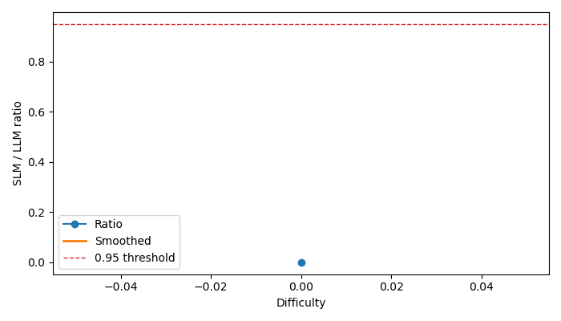

# Part A - Benchmark Setup

- Benchmark: `code_generation`
- Run path: `code_generation\runs_hf_llama1b_gemini_smoke\run_20260317_185527`

## Task Definition

```json
{
  "task": "code_generation",
  "datasets": [
    "HumanEval",
    "MBPP"
  ]
}
```

## Dataset and Sampling

```json
{
  "human_eval_sample": 1,
  "mbpp_sample": 1,
  "time_budget_minutes": 2,
  "execution_timeout_seconds": 10,
  "seed": 42,
  "prompt_variant": "default",
  "generations_per_task": 1,
  "reproducibility_retries": 0,
  "blocked_imports": [
    "subprocess",
    "socket",
    "requests",
    "urllib",
    "httpx",
    "aiohttp",
    "ftplib",
    "telnetlib",
    "shutil"
  ],
  "blocked_calls": [
    "os.system",
    "os.remove",
    "os.rmdir",
    "os.unlink",
    "os.removedirs",
    "shutil.rmtree",
    "subprocess.run",
    "subprocess.Popen",
    "subprocess.call",
    "socket.socket",
    "requests.get",
    "requests.post",
    "urllib.request.urlopen"
  ]
}
```

## Experimental Setup

```json
{
  "models": [
    {
      "label": "Llama 3.2 1B (HF API)",
      "kind": "hf_api",
      "model_name": "meta-llama/Llama-3.2-1B-Instruct",
      "load_in_4bit": false,
      "use_chat_template": false,
      "api_key_env": "HF_TOKEN",
      "max_input_tokens": null,
      "input_cost_per_1k_tokens": 0.0,
      "output_cost_per_1k_tokens": 0.0,
      "extra": {}
    },
    {
      "label": "Gemini Flash",
      "kind": "gemini",
      "model_name": "gemini-2.5-flash",
      "load_in_4bit": false,
      "use_chat_template": false,
      "api_key_env": "GEMINI_API_KEY",
      "max_input_tokens": null,
      "input_cost_per_1k_tokens": 0.0,
      "output_cost_per_1k_tokens": 0.0,
      "extra": {}
    }
  ],
  "generation": {
    "temperature": 0.2,
    "max_new_tokens": 128,
    "min_new_tokens": 48,
    "top_p": 1.0,
    "seed": 42,
    "profile": "default",
    "adaptive_max_new_tokens": false
  }
}
```

## Metrics

```json
[
  {
    "model": "Llama 3.2 1B (HF API)",
    "model_name": "meta-llama/Llama-3.2-1B-Instruct",
    "time_budget_minutes": 2,
    "human_eval_attempted": 1,
    "mbpp_attempted": 1,
    "total_attempted": 2,
    "tasks_completed_in_budget": 2,
    "pass@1": 0.0,
    "syntax_error_rate": 0.0,
    "runtime_failure_rate": 0.5,
    "logical_failure_rate": 0.5,
    "reliability_score": 0.0,
    "self_consistency_score": null,
    "format_compliance": 1.0,
    "signature_compliance": 1.0,
    "instruction_adherence": 1.0,
    "deterministic_reproducibility": null,
    "unsafe_code_rate": 0.0,
    "avg_latency_seconds": 1.1961471999820787,
    "p95_latency_seconds": 1.3868362999637611,
    "tokens_per_second": 24.919317204387553,
    "peak_ram_gb": 0.0108795166015625,
    "avg_output_tokens": 26.5,
    "cost_per_request": 0.0
  },
  {
    "model": "Gemini Flash",
    "model_name": "gemini-2.5-flash",
    "time_budget_minutes": 2,
    "human_eval_attempted": 1,
    "mbpp_attempted": 1,
    "total_attempted": 2,
    "tasks_completed_in_budget": 2,
    "pass@1": 0.0,
    "syntax_error_rate": 1.0,
    "runtime_failure_rate": 0.0,
    "logical_failure_rate": 0.0,
    "reliability_score": 0.0,
    "self_consistency_score": null,
    "format_compliance": 0.0,
    "signature_compliance": 0.0,
    "instruction_adherence": 0.0,
    "deterministic_reproducibility": null,
    "unsafe_code_rate": 0.0,
    "avg_latency_seconds": 1.142901500017615,
    "p95_latency_seconds": 1.1583095000241883,
    "tokens_per_second": 5.250750567249648,
    "peak_ram_gb": 0.0,
    "avg_output_tokens": 6,
    "cost_per_request": 0.0
  }
]
```

## Raw Benchmark Results

```json
{
  "task_result_count": 4
}
```

# Part B - SDDF Analysis

- Benchmark: `code_generation`
- Run path: `code_generation\runs_hf_llama1b_gemini_smoke\run_20260317_185527`
- Interpretation note: sections marked `partial` are inference-augmented summaries derived from historical benchmark artifacts rather than fresh matched reruns.

## SDDF: Dominant Difficulty Dimension

- Status: `available`
- Reason: Computed from SDDF archive.

### Summary

- `R_hat`: 4 examples

## Difficulty Annotation + Binning

- Status: `available`
- Reason: Computed from SDDF archive.

### Bin Counts

- Bin `nan` / `LLM`: 2 rows
- Bin `nan` / `SLM`: 2 rows

## Matched SLM vs LLM Analysis

- Status: `available`
- Reason: Computed from SDDF archive.

### Pairs

- `meta-llama/Llama-3.2-1B-Instruct` vs `gemini-2.5-flash` on `HumanEval`: 1 matched examples
- `meta-llama/Llama-3.2-1B-Instruct` vs `gemini-2.5-flash` on `MBPP`: 1 matched examples

## Capability Curve + Tipping Point

- Status: `available`
- Reason: Computed from SDDF archive.

### meta-llama/Llama-3.2-1B-Instruct vs gemini-2.5-flash

- Tipping point: `None`
- Tipping sensitivity: `{'0.90': None, '0.93': None, '0.95': None, '0.97': None}`
- Plot file: `code_generation\runs_hf_llama1b_gemini_smoke\run_20260317_185527\sddf\reports\humaneval_meta_llama_llama_3_2_1b_instruct_vs_gemini_2_5_flash.png`



### meta-llama/Llama-3.2-1B-Instruct vs gemini-2.5-flash

- Tipping point: `None`
- Tipping sensitivity: `{'0.90': None, '0.93': None, '0.95': None, '0.97': None}`
- Plot file: `code_generation\runs_hf_llama1b_gemini_smoke\run_20260317_185527\sddf\reports\mbpp_meta_llama_llama_3_2_1b_instruct_vs_gemini_2_5_flash.png`


## Uncertainty Analysis

- Status: `available`
- Reason: Computed from SDDF archive.

### meta-llama/Llama-3.2-1B-Instruct vs gemini-2.5-flash

- Tipping median: `None`
- 95% CI: `None` to `None`
- Threshold sweep: `{'0.90': None, '0.93': None, '0.95': None, '0.97': None}`

### meta-llama/Llama-3.2-1B-Instruct vs gemini-2.5-flash

- Tipping median: `None`
- 95% CI: `None` to `None`
- Threshold sweep: `{'0.90': None, '0.93': None, '0.95': None, '0.97': None}`


## Failure Taxonomy

- Status: `available`
- Reason: Computed from SDDF archive.

- Heuristic structural failures: 0
- Heuristic fixable failures: 4
- Invalid outputs: 2
- Validity note: partial or invalid runs should be excluded from strict cross-model comparison.
- Note: this taxonomy is heuristic and should be reviewed against task-specific failure labels.

## Quality Gate

- Status: `available`
- Reason: Computed from SDDF archive.

### meta-llama/Llama-3.2-1B-Instruct vs gemini-2.5-flash


### meta-llama/Llama-3.2-1B-Instruct vs gemini-2.5-flash


## Size-First Decision Matrix

- Status: `available`
- Reason: Computed from SDDF archive.

### meta-llama/Llama-3.2-1B-Instruct vs gemini-2.5-flash

- Bin `0` at difficulty `0.000` contributes to the tau-based threshold evidence.

### meta-llama/Llama-3.2-1B-Instruct vs gemini-2.5-flash

- Bin `0` at difficulty `0.000` contributes to the tau-based threshold evidence.


## Two-Stage Routing Policy

- Status: `available`
- Reason: Computed from SDDF archive.

### meta-llama/Llama-3.2-1B-Instruct vs gemini-2.5-flash

- No routing threshold learned.

### meta-llama/Llama-3.2-1B-Instruct vs gemini-2.5-flash

- No routing threshold learned.


