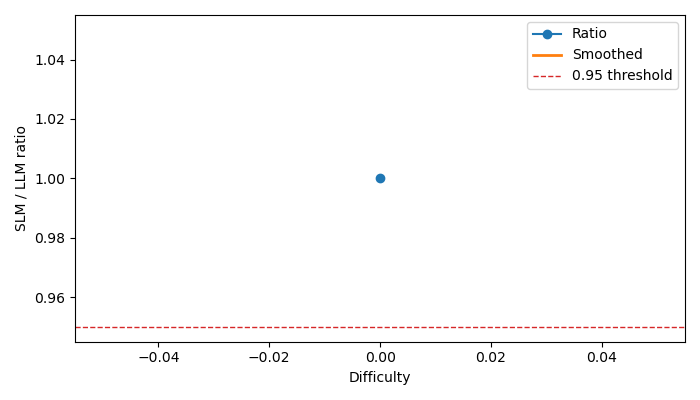

# Part B - SDDF Analysis

- Benchmark: `text_generation`
- Run path: `text_generation\results\runs\hf_llama32_1b_gemini_2shot`
- Interpretation note: sections marked `partial` are inference-augmented summaries derived from historical benchmark artifacts rather than fresh matched reruns.

## SDDF: Dominant Difficulty Dimension

- Status: `available`
- Reason: Computed from SDDF archive.

### Summary

- `|Gamma|`: 4 examples

## Difficulty Annotation + Binning

- Status: `available`
- Reason: Computed from SDDF archive.

### Bin Counts

- Bin `nan` / `LLM`: 2 rows
- Bin `nan` / `SLM`: 2 rows

## Matched SLM vs LLM Analysis

- Status: `available`
- Reason: Computed from SDDF archive.

### Pairs

- `hf_llama32_1b` vs `gemini-2.5-flash-fresh` on `samples`: 2 matched examples

## Capability Curve + Tipping Point

- Status: `available`
- Reason: Computed from SDDF archive.

### hf_llama32_1b vs gemini-2.5-flash-fresh

- Tipping point: `None`
- Tipping sensitivity: `{'0.90': None, '0.93': None, '0.95': None, '0.97': None}`
- Plot file: `text_generation\results\runs\hf_llama32_1b_gemini_2shot\sddf\reports\samples_hf_llama32_1b_vs_gemini_2_5_flash_fresh.png`

## Uncertainty Analysis

- Status: `available`
- Reason: Computed from SDDF archive.

### hf_llama32_1b vs gemini-2.5-flash-fresh

- Tipping median: `None`
- 95% CI: `None` to `None`
- Threshold sweep: `{'0.90': None, '0.93': None, '0.95': None, '0.97': None}`

## Failure Taxonomy

- Status: `available`
- Reason: Computed from SDDF archive.

- Heuristic structural failures: 0
- Heuristic fixable failures: 4
- Invalid outputs: 0
- Validity note: partial or invalid runs should be excluded from strict cross-model comparison.
- Note: this taxonomy is heuristic and should be reviewed against task-specific failure labels.

## Quality Gate

- Status: `available`
- Reason: Computed from SDDF archive.

### hf_llama32_1b vs gemini-2.5-flash-fresh

## Deployment Zones

- Status: `available`
- Reason: Computed from SDDF archive.

### hf_llama32_1b vs gemini-2.5-flash-fresh

- Bin `0` at difficulty `0.000` -> Zone `A`

## Routing Policy

- Status: `available`
- Reason: Computed from SDDF archive.

### hf_llama32_1b vs gemini-2.5-flash-fresh

- No routing threshold learned.

